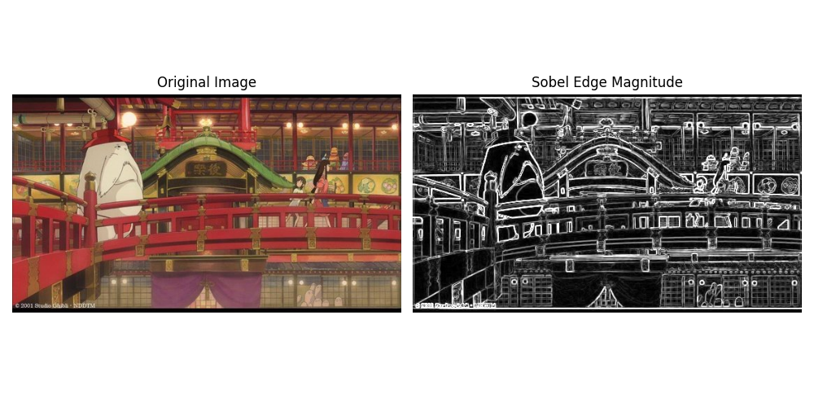
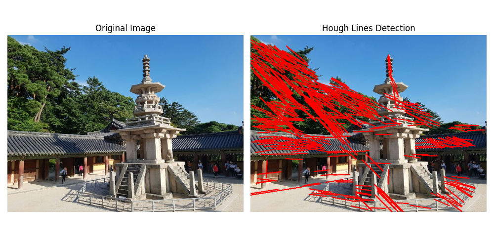
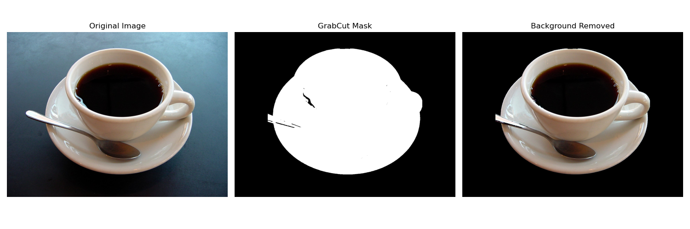

# 컴퓨터 비전 OpenCV 실습 (Edge and Region)

컴퓨터 비전 수업의 에지 검출 및 영역 분할 실습 과제 저장소입니다.  
총 3개의 실습(Sobel Edge, Canny & Hough Transform, GrabCut)으로 구성되어 있으며, 컴퓨터 비전에서 물체를 인식하기 위한 가장 기본적인 단서인 '경계(Boundary)'를 다루는 기법을 배웁니다.

---

## 환경 설정

| 항목 | 버전/도구 |
|---|---|
| Python | 3.10+ |
| 패키지 관리 | Anaconda (conda) |
| 주요 라이브러리 | `opencv-python`, `numpy`, `matplotlib` |

```bash
# conda 가상환경 생성 및 활성화
conda create -n cv python=3.10
conda activate cv

# 필요한 패키지 설치
pip install opencv-python numpy matplotlib
```

## 실행 방법

프로젝트 루트(`computer_vison/3/`)에서 터미널을 열고 다음 명령어들을 실행합니다:

```bash
python task1_sobel.py
python task2_hough.py
python task3_grabcut.py
```

---

## 실습 01 — Sobel Edge Detection 

### 1. 과제에 대한 설명
이미지를 흑백(Grayscale)으로 변환한 뒤, 소벨(Sobel) 필터를 이용해 x축 방향과 y축 방향의 밝기 변화량(미분)을 각각 검출하고 이를 종합하여 최종 에지 강도(Magnitude) 맵을 출력합니다.
- 조명이 선명하고 픽셀 밝기가 급격히 변하는 지점(객체의 경계선)을 1차 미분의 봉우리 값을 이용해 수학적으로 검출해냅니다.
- 64비트 연산 적용, 강도 계산(Magnitude), 8비트 캐스팅(convertScaleAbs)의 제약조건을 준수합니다.

### 2. 핵심 코드 설명
```python
# [핵심] 미분값이 음수가 나올 수 있으므로 반드시 64비트 실수형(CV_64F) 데이터 타입 지정 필수
grad_x = cv.Sobel(gray, cv.CV_64F, 1, 0, ksize=3)
grad_y = cv.Sobel(gray, cv.CV_64F, 0, 1, ksize=3)

# [핵심] X축과 Y축 미분값을 바탕으로 최종 에지 강도 계산
# 공식: root(x_edge^2 + y_edge^2)
magnitude = cv.magnitude(grad_x, grad_y)

# [핵심] 화면상에 시각화하기 위해 절대값을 취해 8비트 양수(uint8)로 안전하게 캐스팅 마무리
magnitude_8u = cv.convertScaleAbs(magnitude)
```

### 3. 전체 코드
```python
import cv2 as cv
import numpy as np
import matplotlib.pyplot as plt
import os 

def main():
    # 이미지가 저장된 상대 경로를 문자열로 지정합니다.
    img_path = 'images/edgeDetectionImage.jpg' 
    
    # 지정한 경로에 파일이 실제로 존재하는지 1차적으로 확인합니다.
    if not os.path.exists(img_path): 
        print(f"Error: {img_path} not found.") # 파일이 없다면 에러 메시지를 터미널에 출력합니다.
        return # 더 이상 불필요한 연산을 진행하지 않고 함수를 강제 종료합니다.

    # 1. 파일 경로로부터 이미지를 복호화하여 BGR 포맷의 NumPy 다차원 배열로 읽어옵니다.
    img = cv.imread(img_path) 
    
    # 2. 이미지의 밝기 변화량만을 추적하기 위해 컬러 프레임을 단일 채널인 흑백(Grayscale) 영상으로 변환합니다.
    gray = cv.cvtColor(img, cv.COLOR_BGR2GRAY) 
    
    # 3. 소벨(Sobel) 필터를 적용하여 x축(수평) 방향의 밝기 변화량 곡면(미분)을 구합니다.
    # [중요 제약] 미분값이 음수로 떨어지는 데이터 손실을 방지하기 위해 출력 자료형을 64비트 실수형(cv.CV_64F)으로 둡니다.
    grad_x = cv.Sobel(gray, cv.CV_64F, 1, 0, ksize=3) 
    
    # 동일한 방식으로 y축(수직) 방향의 밝기 변화량(에지)을 소벨 필터로 검출합니다.
    grad_y = cv.Sobel(gray, cv.CV_64F, 0, 1, ksize=3) 
    
    # 4. 구해진 x축, y축 두 방향의 미분값을 벡터 합성(Magnitude)하여 최종 에지 강도를 계산합니다.
    magnitude = cv.magnitude(grad_x, grad_y) 
    
    # 5. 넓은 범위의 실수형으로 계산된 강도에 절댓값을 취하고, 시각적 디스플레이가 가능한 8비트 정수형(uint8)으로 자동 축소 캐스팅합니다.
    magnitude_8u = cv.convertScaleAbs(magnitude) 
    
    # 6. Matplotlib으로 원본 비교 시 푸르게 나오는 현상을 막고자, 원본의 BGR 채널들을 RGB 포맷으로 재정렬합니다.
    img_rgb = cv.cvtColor(img, cv.COLOR_BGR2RGB) 
    
    # 출력물을 띄울 가로 10인치, 세로 5인치 크기의 캔버스(도화지)를 설정합니다.
    plt.figure(figsize=(10, 5)) 
    
    # 1행 2열 레이아웃 구조를 잡은 다음 그 중 첫 번째(왼쪽) 그리기 영역을 선택합니다.
    plt.subplot(1, 2, 1) 
    # 원본(RGB) 배열 이미지를 왼쪽 영역에 렌더링합니다.
    plt.imshow(img_rgb) 
    # 왼쪽 그림 상단에 'Original Image'라는 영문 제목표를 달아줍니다.
    plt.title('Original Image') 
    # 불필요한 주변 XY 그래프 눈금과 테두리 선들을 보이지 않게 꺼버립니다.
    plt.axis('off') 
    
    # 1행 2열 레이아웃 구조 중 두 번째(오른쪽) 그리기 영역으로 포커스를 이동합니다.
    plt.subplot(1, 2, 2) 
    # 검출한 최종 에지 강도 영상을 흑백 컬러맵(gray) 옵션과 함께 오른쪽 영역에 렌더링합니다.
    plt.imshow(magnitude_8u, cmap='gray') 
    # 오른쪽 그림 상단에 'Sobel Edge Magnitude'라는 영문 제목을 지정합니다.
    plt.title('Sobel Edge Magnitude') 
    # 역시 어색함을 주는 좌표 눈금선과 박스를 화면에서 숨깁니다.
    plt.axis('off') 
    
    # 켜진 여러 시각화 컴포넌트 간 여백 및 글씨 겹침을 내부 엔진이 적절히 자동 조절해줍니다.
    plt.tight_layout() 
    
    # 최종적으로 세팅된 비교 컴포넌트들을 미리 지정해둔 폴더 안에 이미지(.png) 파일로 보존합니다.
    plt.savefig('result_images/result_task1_sobel.png') 
    # 파이썬 저장 코드가 정상적으로 수행 완료되었음을 콘솔(터미널)을 통해 운영자에게 알립니다.
    print("성공적으로 result_images/result_task1_sobel.png 파일로 저장되었습니다.") 
    
    # plt.show() # (팝업 이미지를 현장에서 시각화할 때 주석을 제거하고 띄우기 용도로 둡니다)

if __name__ == '__main__': # 파이썬 모듈이 외부 임포트가 아닌 인터프리터에서 직접 실행되었을 때만 발동합니다.
    main() # 메인 함수를 호출합니다.
```

### 4. 최종 결과물



---

## 실습 02 — Canny Edge & Hough Transform Line Detection

### 1. 과제에 대한 설명
가장 신뢰받는 엣지 검출기 중 하나인 캐니 에지(Canny Edge) 알고리즘을 사용해 잡음이 통제된 1픽셀 두께의 얇은 윤곽선(Edge Map)을 추출합니다. 그 후 허프 변환(Hough Transform) 공간에 좌표계 투표를 진행하여, 수학적으로 유효한 '직선' 오브젝트를 원본 이미지 위에 덧그리는 실습입니다.
- 최적의 직선을 끊기지 않고 튜닝해 내기 위한 `minLineLength`, `maxLineGap` 파라미터 제어가 포인트입니다.

### 2. 핵심 코드 설명
```python
# [핵심] Canny 엣지 알고리즘 (이중 임계값 방식 적용)
# threshold1(100)과 threshold2(200)의 상하한선을 고정적으로 입력
edges = cv.Canny(gray, threshold1=100, threshold2=200)

# [핵심] 튜닝 노가다가 필요한 허프 변환 파라미터들을 코드 상단에 변수화하여 가독성 증진
hough_threshold = 80            # 직선으로 판단할 최소 교차점 수
minLineLength = 40              # 선분의 최소 픽셀 길이 제한 (먼지 제거)
maxLineGap = 5                 # 점선처럼 끊어진 엣지도 동일 선으로 연결해주는 허용 간극

# [핵심] 확률적 허프 변환 적용 및 라인 복귀
lines = cv.HoughLinesP(edges, rho, theta, hough_threshold, 
                       minLineLength=minLineLength, maxLineGap=maxLineGap)
```

### 3. 전체 코드
```python
import cv2 as cv 
import numpy as np
import matplotlib.pyplot as plt
import os

def main(): 
    # 불러올 이미지 파일의 상대적 폴더 경로를 특정 문자열 변수에 담습니다.
    img_path = 'images/dabo.jpg' 
    
    # 스크립트 도는 도중 해당 파일이 실제 존재하는지 조사합니다.
    if not os.path.exists(img_path): 
        print(f"Error: {img_path} not found.") # 파괴적인 오류 에러를 막고자 단서 메시지만 터미널로 흘립니다.
        return # 더 이상의 뒷 연산 흐름을 폐기하고 함수 바깥으로 탈출합니다.

    # 1. 대상 원본 이미지를 지정한 위치로부터 BGR 3채널의 색조 해상도를 지닌 숫자 집합 형태로 읽어냅니다.
    img = cv.imread(img_path) 
    
    # 2. 에지 검출 연산 공식을 적용하기 위해 컬러 스페이스를 밝기 성분만 지닌 단일 채널(Grayscale)로 치환합니다.
    gray = cv.cvtColor(img, cv.COLOR_BGR2GRAY) 
    
    # 3. 내부적으로 노이즈 블러를 수행하는 캐니(Canny) 알고리즘으로 윤곽을 아주 예리하게 선별해냅니다.
    # threshold1(100)은 잔가지를 날려버리는 낮은 엣지 문턱 하한선이며, threshold2(200)는 이 선을 넘으면 무조건 본체 윤곽이라 단정하는 상한선입니다.
    edges = cv.Canny(gray, threshold1=100, threshold2=200) 
    
    # 4. 투표 체계를 바탕으로 한 허프 변환(HoughLinesP)에 던져줄 예민한 하이퍼 파라미터들을 상단 블록에 변수로 일일이 분리해 줍니다.
    rho = 1                         # 원점 기준 수직 거리(r) 공간의 분해능, 해상도를 뜻합니다 (1 픽셀씩 탐색).
    theta = np.pi / 180             # 원점 기준 각도(세타) 공간의 분해능, 해상도를 뜻합니다 (1도씩 촘촘히 탐색).
    hough_threshold = 80            # 동일 직선상에 위치했다고 투표가 쌓인 교차점 수치가 최소 80이 넘어야만 직선 판정 통과를 줍니다.
    minLineLength = 40              # 너무 작디 작은 부스러기 노이즈 선분을 무시할 최소 제한 잣대(픽셀단위)입니다.
    maxLineGap = 5                 # 점선으로 조각난 엣지도 동일 선상의 동료라면 하나의 길다란 직선 그룹으로 수놓도록 해주는 최대 허용 간격입니다.
    
    # 상기된 강력한 제어 파라미터를 사용해 에지 맵에서 유의미한 직선 조각들의 시작 및 끝 좌표 리스트를 돌려받습니다.
    lines = cv.HoughLinesP(edges, rho, theta, hough_threshold, 
                           minLineLength=minLineLength, maxLineGap=maxLineGap)
                           
    # 5. 발견한 선을 마음껏 스케치용으로 쓸 수 있게끔 원본 사진 데이터 행렬의 완전 독립된 복제를 하나 확보합니다.
    result_img = img.copy() 
    
    # 만약 유효한 라인이 하나도 찾아지지 않고 빈 None 데이터가 올 경우의 에러 크래시를 방지할 제어문입니다.
    if lines is not None: 
        # 발견된 라인을 포함하는 좌표 객체들의 요소를 모조리 하나하나 루프에서 까봅니다.
        for line in lines: 
            # 3차원의 복잡한 배열 껍질을 벗겨내고 우리가 쓸 (x1,y1)->시작, (x2,y2)->도착 4등분 요소로 변수 분해를 시킵니다.
            x1, y1, x2, y2 = line[0] 
            # 떼놓은 복사본 투시 도면 위에 방금 언패킹한 시작-도착 점에 걸맞은 붉은색(BGR 0,0,255 형상) 두께 2 픽셀의 라인을 죽 긋어 새겨줍니다.
            cv.line(result_img, (x1, y1), (x2, y2), (0, 0, 255), 2) 
            
    # 6. OpenCV의 고질적 파란 계통 렌더링 색수차를 막고자 원본 사진을 matplotlib와 친화도가 높은 순수 RGB 모드로 갈아입힙니다.
    img_rgb = cv.cvtColor(img, cv.COLOR_BGR2RGB) 
    # 선이 그려진 복제품 그림도 붉은 선이 파란 선으로 오해 표시되지 않게 RGB 체제로 나란히 환승시킵니다.
    result_img_rgb = cv.cvtColor(result_img, cv.COLOR_BGR2RGB) 
    
    # 7. 모니터 관람용 비율로 가로 10인치, 세로 5인치 규격의 판을 거대하게 짜 올립니다.
    plt.figure(figsize=(10, 5)) 
    
    # 그려질 레이아웃을 1행 2열로 토막 낸 다음 첫 지역권에 포커스와 권한을 이양받습니다.
    plt.subplot(1, 2, 1) 
    # 첫 구획에 앞서 RGB 처리한 원래 고태의 퓨어 이미지를 발라 버립니다.
    plt.imshow(img_rgb) 
    # 첫 구획 위쪽에 Original Image 라고 고유 네임을 아로새깁니다.
    plt.title('Original Image') 
    # 눈 썩는 무가치한 xy 숫자 단위선 지지대들을 완전히 날려줍니다.
    plt.axis('off') 
    
    # 1행 2열 중 오른편 구획으로 도면 그리기 포커스를 전환시킵니다.
    plt.subplot(1, 2, 2) 
    # 오른편 구획에 빨강 직선들이 입혀진 최후 결과 컷 이미지를 출력 렌더링하도록 쏩니다.
    plt.imshow(result_img_rgb) 
    # Hough Lines Detection 안내글 레이블을 헤더에 입양합니다.
    plt.title('Hough Lines Detection') 
    # 이곳 구역도 좌표 눈금 표시를 제거해 깔끔한 전시용 패널 스탠스를 확립합니다.
    plt.axis('off') 
    
    # plt 그래프 내부 컴포넌트들의 폭이나 여유 틈새를 뭉개지지 않게 스스로 촘촘히 튜닝해 주는 내부 명령어 장치입니다.
    plt.tight_layout() 
    # 이 아름답게 정렬된 비교샷을 모니터 스킵하고 result_images 폴더 디렉토리에 고해상도 .png 확장자로 바로 저장 찍어버리게 합니다.
    plt.savefig('result_images/result_task2_hough.png') 
    # 아무 반응 없이 프로그램이 죽은 듯 여겨지지 않게 수행 안도감을 주는 핑 메시지를 마지막 터미널에 띠크 던집니다.
    print("성공적으로 result_images/result_task2_hough.png 파일로 저장되었습니다.") 

if __name__ == '__main__': # 코드 라이브러리 차용 상황이 아닐 때만 작동토록 만들어둔 클래식 방어문입니다.
    main() # 모든 걸 관제하는 main 루틴을 본격적으로 호출 활성화시킵니다.
```
### 4. 최종 결과물



---

## 실습 03 — GrabCut Interactive Segmentation

### 1. 과제에 대한 설명
가장 널리 쓰이는 대화식 영역 분할 모델인 GrabCut 알고리즘을 제어하여, 사용자가 사진 위에 관심 있어하는 컵 객체 부위 사각형을 씌워 넘겨주면, 이를 확률적으로 파악해 가장 핵심 전경(Frontend)인 컵만 추출하고 어지러운 뒷배경(Backend) 요소를 완전히 소거해 냅니다.
- 객체를 감싸는 직관적인 Bounding Rect 지정이 핵심인 파트입니다.
- 필수 요구사항인 `bgdModel`, `fgdModel` 빈 모방 생성 룰을 철저히 준수합니다.
- `np.where` 연산을 통해 분류 마스크 값을 후처리 이진화합니다.

### 2. 핵심 코드 설명
```python
# [핵심] GrabCut 구동을 위한 내부 Gaussian Mixture Model 필수 초기화
# 64비트의 float 배열로 1행 65열 강제 세팅 불이행 시 에러 직결
bgdModel = np.zeros((1, 65), np.float64)
fgdModel = np.zeros((1, 65), np.float64)

# [핵심] 하드코딩 오차 방지를 위해 통계적 이미지 비율에 따른 동적 사각형 구역 산출
h, w = img.shape[:2]
rect = (10, 10, w - 20, h - 20)

cv.grabCut(img, mask, rect, bgdModel, fgdModel, 5, cv.GC_INIT_WITH_RECT)

# [핵심] Numpy의 강력한 where을 활용하여 GrabCut 마스크 값들을 0(배경)과 1(전경)의 이분 구조로 분리 
mask_binary = np.where((mask == cv.GC_PR_BGD) | (mask == cv.GC_BGD), 0, 1).astype('uint8')

# [핵심] 배경 부분 행렬을 0으로 만들어 까맣게 차단 (np.newaxis를 활용한 트릭)
result_img = img * mask_binary[:, :, np.newaxis]
```
> **포인트**: 마스크를 0과 1로 구분하는 `mask_binary` 배열 단일 연산 과정은 루프 반복문(`for`)보다 속도가 훨씬 빠르며, RGB 컬러 3채널과 크기를 맞추기 위해 1채널 흑백 마스크에 `np.newaxis`를 이용해 차원을 억지로 늘려주는 트릭이 핵심 테크닉입니다.

### 3. 전체 코드
```python
import cv2 as cv 
import numpy as np
import matplotlib.pyplot as plt
import os

def main():
    # 대상으로 다뤄질 원본 이미지 형태인 컵 사진의 상대 경로를 스트링 데이터로 저장합니다.
    img_path = 'images/coffee cup.JPG' 
    
    # 1. 파일 시스템에 위치한 커피 컵 원본 이미지를 BGR 3채널의 색조 해상도를 지닌 숫자 집합 형태(배열)로 생성합니다.
    img = cv.imread(img_path) 
    
    # 2. GrabCut 알고리즘 내내 지속적으로 분류 기준값이 담길 공백 상태의 도화지(마스크) 배열을 사진 가로세로 규격과 동일치로 초기화시킵니다 (0 채움).
    mask = np.zeros(img.shape[:2], np.uint8) 
    
    # ※ 가장 중요한 요구사항 조치구간: GrabCut 백그라운드 구동에 필수적으로 동반될 가우시안 믹스처 모델(GMM)의 뼈대 변수를 빈 실수형 65차원으로 초기화합니다.
    bgdModel = np.zeros((1, 65), np.float64) 
    fgdModel = np.zeros((1, 65), np.float64) 
    
    # 3. 객체(컵)가 정확히 머물고 있을 것으로 짐작되는 초기 바운딩 사각형(Rect) 지역을 추론하기 위해 해상도를 추출합니다.
    h, w = img.shape[:2] # 높이(Height)와 가로 폭(Width) 치수를 투플 속성에서 끄집어 가져옵니다.
    # 임의 숫자를 하드코딩하지 않고, 이미지 가로폭의 사진 외곽 테두리를 배경(Background) 샘플로 사용하기 위해 x, y 시작점을 10픽셀로 둡니다.
    x, y = 10, 10 
    # 가로와 세로 폭을 화면 전체 길이에서 양쪽 테두리 여백 20픽셀을 뺀 크기로 꽉 채워 설정합니다.
    rect_w, rect_h = w - 20, h - 20 
    # 산출해낸 4가지 수치를 단일 튜플 구조(x, y, w, h)로 변환해서 하나로 강하게 뭉쳐줍니다.
    rect = (x, y, rect_w, rect_h) 
    
    # 4. 방금 추론한 렉트 좌표(Rect)를 중심으로 주변은 무조건 배경치고 안쪽은 전경 후보로 상정하여 분류기(GrabCut)를 5사이클 동안 반복 학습하며 실행합니다.
    cv.grabCut(img, mask, rect, bgdModel, fgdModel, 5, cv.GC_INIT_WITH_RECT) 
    
    # 5. 분류가 끝난 마스크 안에는 네 가지 라벨링 정수(0:배경, 1:전경, 2:배경일듯, 3:전경일듯)가 복잡하게 산재해 있습니다. 후처리 정리가 시급합니다.
    # Numpy의 where 불리언 잣대를 사용하여 값이 cv.GC_PR_BGD 와 cv.GC_BGD 일 경우 가차없이 0(검은색)으로 치환하고 나머지를 1로 바꿔 완전한 이진 데이터 파이프라인으로 캐스팅합니다.
    mask_binary = np.where((mask == cv.GC_PR_BGD) | (mask == cv.GC_BGD), 0, 1).astype('uint8') 
    
    # 6. 원본 이미지 행렬 스칼라에 이진 마스크 행렬을 무작위 곱셈하여, 배경 영역(0)은 무색 암흑화시키고 컵 영역(1)만 밝기 100%를 통과시키도록 오버레이시킵니다.
    # 이때 3차원 컬러 사진과 차원 축을 맞추고자 np.newaxis 트릭으로 억지로 마스크의 채널을 1개 증폭시켜줍니다.
    result_img = img * mask_binary[:, :, np.newaxis] 
    
    # 7. 화면(Matplotlib)에 오버랩 시 색 정보가 멍든 것처럼 청색으로 물드는 참사를 막기 위해 BGR 파장축을 RGB로 순서를 스위칭해줍니다.
    img_rgb = cv.cvtColor(img, cv.COLOR_BGR2RGB) 
    # 배경 따내기가 완료되어 완성된 알맹이 컵 사진도 동일하게 RGB 체제로 바꿔 통일감을 기합니다.
    result_img_rgb = cv.cvtColor(result_img, cv.COLOR_BGR2RGB) 
    
    # 8. 대규모 도해도(가로 15, 세로 5)를 설계하여 3가지 상태(원본, 마스크, 적용 결과)를 연속으로 보여줄 모니터 환경을 오픈합니다.
    plt.figure(figsize=(15, 5)) 
    
    # 세 폭의 분할 칸막이 중 제일 으뜸(첫 번째) 진영을 점유합니다.
    plt.subplot(1, 3, 1) 
    # 이 구역에 색 교환을 마친 티없이 깨끗한 원본 RGB 이미지를 놓습니다.
    plt.imshow(img_rgb) 
    # 위쪽에 관람자가 구별 가능하게 끔 'Original Image' 명판을 씌웁니다.
    plt.title('Original Image') 
    # 그래프 용도로 생성된 수평 수직 가로 눈금들을 철저하게 비가시화(off)시킵니다.
    plt.axis('off') 
    
    # 세 폭의 분할 칸막이 중 허리 역할을 하는 넘버투(두 번째) 진영을 차지합니다.
    plt.subplot(1, 3, 2) 
    # 0과 1로 포장되어 칠흑같이 어둡게 된 이진 마스크에 고의적으로 255를 전면 곱해, 배경은 검정, 컵은 완벽한 하얀색으로 보이게 한 뒤, 흑백 필터 맵(gray)으로 송출합니다.
    plt.imshow(mask_binary * 255, cmap='gray')   
    # 명확하게 'GrabCut Mask'라는 제목 레이블을 삽입합니다.
    plt.title('GrabCut Mask') 
    # 이곳 역시 좌표 축과 숫자를 허공으로 날려버립니다.
    plt.axis('off') 
    
    # 마지막 분할 칸막이, 대미를 장식할 오른쪽 최고 꼬리 진영(세 번째)을 장악합니다.
    plt.subplot(1, 3, 3) 
    # 최종적으로 주변이 까맣게 날아가고 컵 형상만 아스라이 남은 스크린(결과 행렬)을 매핑합니다.
    plt.imshow(result_img_rgb) 
    # 이 그림 위에도 'Background Removed'라는 유식한 타이틀을 달아둡니다.
    plt.title('Background Removed') 
    # 그래프 외형 장식을 배제하고 그림 자체의 미관만 노출시킵니다.
    plt.axis('off') 
    
    # 3개의 대화면 요소 배열의 중복이나 글씨 침범을 막고자 엔진 스스로 비율과 줄맞춤을 촘촘하게 동기화하도록 구속(tight) 명령을 던집니다.
    plt.tight_layout() 
    # 현재 만들어진 최종 조합 그림판을, result_images 디렉토리 경로에 안전한 범용 파일(.png) 포맷으로 영구 구워냅니다.
    plt.savefig('result_images/result_task3_grabcut.png') 
    # 이 모든 유기적 파이프라인 처리가 탈 없게 돌아가고 저장이 종결됐음을 사람 제어자에게 알림 스피커 통보하듯 콘솔로 띄웁니다.
    print("성공적으로 result_images/result_task3_grabcut.png 파일로 저장되었습니다.") 

if __name__ == '__main__': # 이 문서 자체가 타 스크립트에 라이브러리 식으로 종속된 게 아니라면 내부 동작을 스스로 구동하라는 명령 단서입니다.
    main() # 캡슐처럼 정돈된 main 로직 블록을 최종 기동하며 프로그램을 연주하기 시작합니다.
```

### 4. 최종 결과물


